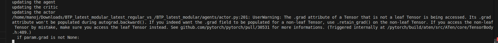

1. Bring all the environment variables to config.py
2. Modify/Verify Loss is -ve or +ve
3. Resolve if torch.nograd warning/error issue.

4. self.flattern_paramters() method isn't returning references to original ones,its returning copies.
5. verify whether all parts of code are correctly getting updated as per point 4.
6. Remove the epsilon greedy method and replace with prob categorical distribution(choosing an action).
7. Learn about Assault Game

Changes made to original code till now:
1. flatten paramters
2. compute rollout logprobs calculation.
